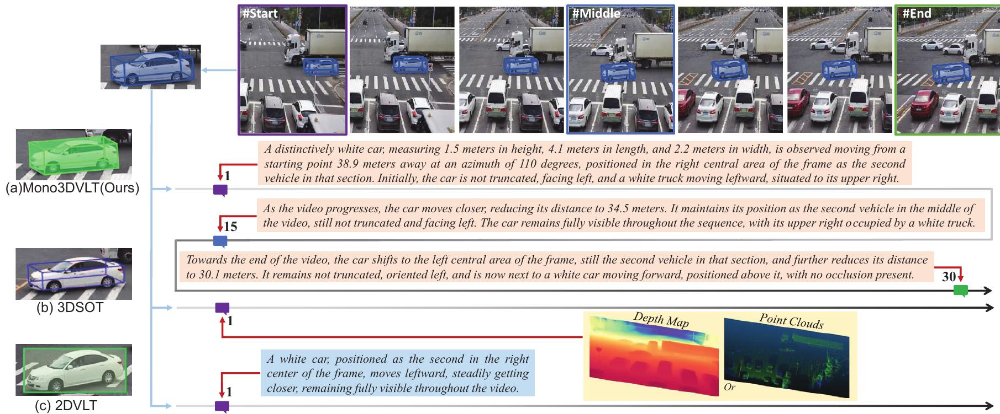

# VLSOT: Monocular-Video-Based 3D Visual-Language Tracking

This repository provides **partial code** for the **VLSOT Challenge (Track A)** — *Monocular-Video-Based 3D Visual-Language Tracking*.  

The task aims to achieve **3D tracking of language-referred targets** using only **monocular RGB video input**, enabling machines to understand and follow objects in 3D space based on natural language instructions.

## 🧠 Task Description
Given a monocular RGB video and a natural language command (e.g., *"track the pedestrian wearing a blue jacket"*),  
the system must predict the target’s:

- 3D position (x, y, z)  
- 3D pose (orientation)  
- Motion trajectory across time  

## 🚧 Core Challenges
- Recovering depth and 3D structure from monocular video  
- Cross-modal alignment between visual and linguistic features  
- Temporal consistency in 3D motion estimation  

## 📂 Code Release
We have **open-sourced part of the core implementation** to support community research and development.  
You are encouraged to:
- Reproduce the released components  
- Implement and improve other modules  
- Explore new designs for monocular 3D visual-language tracking  
